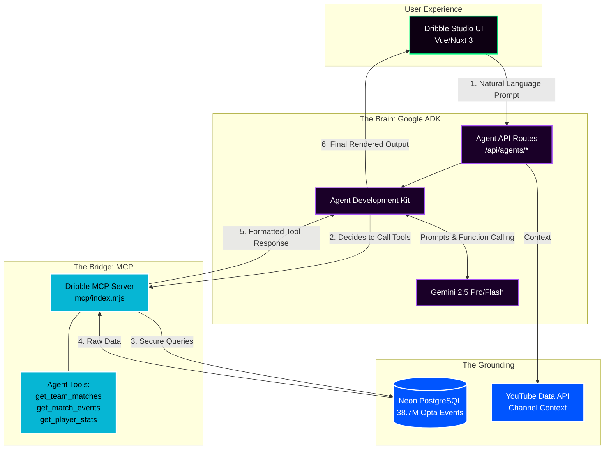

# Dribble Studio - Architecture Diagram

```mermaid
graph TD
    %% Styling
    classDef frontend fill:#0d0012,stroke:#00ff87,stroke-width:2px,color:#fff
    classDef backend fill:#1a0028,stroke:#a855f7,stroke-width:2px,color:#fff
    classDef mcp fill:#06b6d4,stroke:#fff,stroke-width:2px,color:#fff,color:#000
    classDef db fill:#0055ff,stroke:#fff,stroke-width:2px,color:#fff

    subgraph User Experience
        UI[Dribble Studio UI <br/> Vue/Nuxt 3]:::frontend
    end

    subgraph The Brain: Google ADK
        API[Agent API Routes <br/> /api/agents/*]:::backend
        ADK[Agent Development Kit]:::backend
        Gemini[Gemini 2.5 Pro/Flash]:::backend
        
        API --> ADK
        ADK <-->|Prompts & Function Calling| Gemini
    end

    subgraph The Bridge: MCP
        MCPServer[Dribble MCP Server <br/> mcp/index.mjs]:::mcp
        Tools[Agent Tools: <br/> get_team_matches <br/> get_match_events <br/> get_player_stats]:::mcp
        
        MCPServer --- Tools
    end

    subgraph The Grounding
        Neon[(Neon PostgreSQL <br/> 38.7M Opta Events)]:::db
        YT[YouTube Data API <br/> Channel Context]:::db
    end

    %% Data Flow
    UI -- "1. Natural Language Prompt" --> API
    ADK -- "2. Decides to Call Tools" --> MCPServer
    MCPServer -- "3. Secure Queries" --> Neon
    Neon -- "4. Raw Data" --> MCPServer
    MCPServer -- "5. Formatted Tool Response" --> ADK
    API -- "Context" --> YT
    ADK -- "6. Final Rendered Output" --> UI
```
